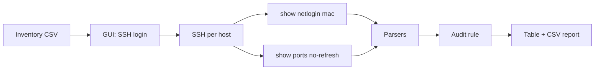

# Rouge Ports Hunter (RPH)

Audit tool for access ports on **Extreme EXOS** switches. It compares `show ports no-refresh` with `show netlogin mac` and reports ports that appear in the port table but are **not** listed in netlogin MAC output, subject to configured exclusions (e.g. uplink, stack).

| | |
|---|---|
| **Name** | Rouge Ports Hunter |
| **Short name** | RPH |
| **Platform** | EXOS 37.x · Netmiko (`device_type=extreme`) |
| **UI** | PySide6 (Qt) |

---

## How it works



| Step | Description |
|------|-------------|
| 1 | Start the app, choose **Hunt** — select inventory CSV (one IPv4 per row) |
| 2 | Enter SSH username and password on the login screen |
| 3 | Per host: SSH and run both commands (progress bar in the GUI) |
| 4 | Compare: port in `show ports` with no entry in `show netlogin mac` → result row (excluding skip list) |
| 5 | View results in the table; CSV is saved to **Downloads** as `RPH_results_<timestamp>.csv` |

Operational messages (skipped rows, SSH errors) are printed to the **console** (terminal where you started the app).

---

## Requirements

| Component | Version / notes |
|-----------|-----------------|
| Python | 3.11 or newer |
| Dependencies | `pip install -r requirements.txt` (Netmiko, PySide6) |
| Network | SSH access to hosts listed in inventory |

---

## Installation and run

### First-time setup

From the repository root (after clone or extract):

```bash
git clone https://github.com/Verter18328/RPH-RougePortsHunter
cd [project-directory]

python -m venv .venv
```

Activate the virtual environment:

| OS | Command |
|----|---------|
| Windows | `.venv\Scripts\activate` |
| Linux / macOS | `source .venv/bin/activate` |

```bash
pip install -r requirements.txt
python main_window.py
```

### Subsequent runs

```bash
cd [project-directory]
# activate .venv — see table above
python main_window.py
```

> If the repository is already on disk, skip `git clone` and use **Subsequent runs** only.

Press **Escape** to return to the home screen (not while a fetch is running).

---

## Inventory file (CSV)

One column per row: IPv4 address. Optional header row `host` (also accepts legacy `host,username,password` header — credentials are **not** read from CSV).

```csv
host
192.168.1.10
192.168.1.11
```

| Column | Requirements |
|--------|----------------|
| `host` | IPv4 address (validated on import) |

SSH **username** (required) and **password** (may be empty) are entered in the application after selecting the inventory file.

Invalid rows are skipped; details are printed to the console.

**Do not commit inventory files** — patterns in `.gitignore` (`inventory.csv`, `inventory*.csv`).

---

## Output report (CSV)

Filename: `RPH_results_<YYYY-MM-DD>_<HH-MM-SS>.csv`  
Location: user **Downloads** folder.

Format:

```csv
Host,Port
192.168.1.10,1:5
```

One row per reported port on a given host.

---

## Repository layout

```
.
├── main_window.py          # Entry point (GUI)
├── business_logic.py       # Audit flow (inventory → SSH → compare → export)
├── signals.py              # Qt signals, worker thread, UI handlers
├── globals.py              # Shared state, inventory file dialog
├── input_data_reciever.py  # CSV inventory read
├── data_validation.py      # IPv4 validation
├── ssh_data_retriever.py   # SSH session, OutputData
├── netlogin_mac_parser.py
├── ports_parser.py
├── export_results.py
├── Ui_Files/main_window.ui
├── requirements.txt
├── LICENSE
└── .gitignore
```

| Module | Responsibility |
|--------|----------------|
| `main_window.py` | Loads `.ui`, starts Qt event loop |
| `business_logic.py` | Core audit: `RougePortsHunter` |
| `signals.py` | Buttons, progress, results table, background fetch |
| `globals.py` | SSH credentials, device list, paths |
| `input_data_reciever.py` | Inventory CSV selection and parsing |
| `data_validation.py` | Host IPv4 validation |
| `ssh_data_retriever.py` | SSH commands and `OutputData` |
| `export_results.py` | CSV export to Downloads |

Operational data excluded from the repo (`.gitignore`): inventory, `samples/`, `output/`, `logs/`, `raw/`, `RPH_results_*.csv` under the project tree.

---

## Port exclusions

`LAB_SAMPLE_SKIP_PORTS` in `business_logic.py` skips laboratory uplink ports (10G stack). In production, exclusions should be **per host** (configure in code or future config).

---

## Development status

| Implemented | Planned |
|-------------|---------|
| CLI parsers, audit rule, lab skip list | Concurrent SSH for large inventories |
| PySide6 GUI (inventory, login, progress, results) | Bastion, secrets management (e.g. `.env`) |
| Inventory import and IPv4 validation | Configurable per-host exclusions |
| SSH and CSV export | — |

---

## Security and sensitive data

- Do not commit inventory files or credentials.
- Reports may contain IP addresses and port identifiers — follow your organization’s network data handling policy.
- Empty passwords are acceptable only where environment policy allows (e.g. isolated lab).

---

## Project information

| Field | Value |
|-------|--------|
| Repository | https://github.com/Verter18328/RPH-RougePortsHunter |
| Author | [Verter18328](https://github.com/Verter18328) |
| License | [MIT](LICENSE) |
