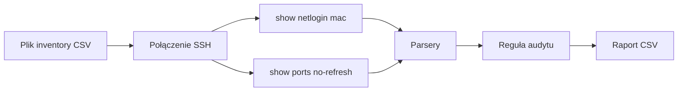

# Rouge Ports Hunter (RPH)

Narzędzie do audytu portów access na przełącznikach **Extreme EXOS**. Porównuje wyniki `show ports no-refresh` z `show netlogin mac` i raportuje porty obecne w tabeli portów, których **nie ma** w liście MAC netlogin, z uwzględnieniem skonfigurowanych wykluczeń (np. uplink, stack).

| | |
|---|---|
| **Nazwa** | Rouge Ports Hunter |
| **Skrót** | RPH |
| **Platforma** | EXOS 37.x · Netmiko (`device_type=extreme`) |

---

## Działanie



| Krok | Opis |
|------|------|
| 1 | Wybór pliku inventory (okno dialogowe) |
| 2 | Dla każdego hosta: SSH i wykonanie obu poleceń |
| 3 | Parsowanie wyjścia CLI do list portów |
| 4 | Porównanie: port z `show ports` bez wpisu w `show netlogin mac` → wpis w raporcie (poza wykluczeniami) |
| 5 | Zapis pliku `RPH_results_<timestamp>.csv` w domyślnym katalogu pobierania użytkownika |

Szczegóły reguły audytu i faz rozwoju: [`docs/plan-python-netlogin-audit-exos.md`](docs/plan-python-netlogin-audit-exos.md).

---

## Wymagania

| Komponent | Wersja / uwagi |
|-----------|----------------|
| Python | 3.11 lub nowszy |
| Netmiko | `pip install -r requirements.txt` |
| tkinter | Moduł standardowy (wybór pliku CSV). Linux: pakiet systemowy `python3-tk` |
| Sieć | Dostęp SSH do hostów zdefiniowanych w inventory |

---

## Instalacja i uruchomienie

### Nowe środowisko

Wykonaj w katalogu głównym repozytorium (po sklonowaniu lub rozpakowaniu):

```bash
# Tylko przy pierwszym pobraniu — [do uzupełnienia: URL repozytorium Git]
git clone [https://github.com/Verter18328/RPH-RougePortsHunter]
cd [folder projektu]

python -m venv .venv
```

Aktywacja środowiska wirtualnego:

| System | Polecenie |
|--------|-----------|
| Windows | `.venv\Scripts\activate` |
| Linux / macOS | `source .venv/bin/activate` |

```bash
pip install -r requirements.txt
python main.py
```

### Kolejne uruchomienia

```bash
cd [folder projektu]
# aktywacja .venv — jak w tabeli powyżej
python main.py
```

> Jeśli repozytorium jest już na dysku lokalnym, pomiń `git clone` i użyj wyłącznie sekcji „Kolejne uruchomienia”.

Po starcie wybierz plik inventory. Komunikaty operacyjne — w konsoli; raport — w katalogu pobierania (domyślnie **Pobrane** / **Downloads**).

---

## Plik inventory (CSV)

Format: nagłówek opcjonalny, wiersze danych.

```csv
host,username,password
[adres IPv4],[użytkownik],[hasło]
```

| Kolumna | Wymagania |
|---------|-----------|
| `host` | Adres IPv4 (walidowany przy imporcie) |
| `username` | Login SSH (wymagany, niepusty) |
| `password` | Hasło SSH — **dozwolone puste** |

Wiersze niepoprawne są pomijane; szczegóły w logu konsoli.

Plików inventory **nie umieszczaj w repozytorium** — wzorce w `.gitignore` (`inventory.csv`, `inventory*.csv`).

---

## Raport wynikowy (CSV)

Nazwa pliku: `RPH_results_<RRRR-MM-DD>_<GG-MM-SS>.csv`

Struktura:

```csv
Host,Ports
[adres IPv4],[slot:port lub port]
```

Jeden wiersz odpowiada jednemu portowi zgłoszonemu na danym hoście.

---

## Struktura repozytorium

```
.
├── main.py
├── input_data_reciever.py
├── data_validation.py
├── ssh_data_retriever.py
├── netlogin_mac_parser.py
├── ports_parser.py
├── export_results.py
├── samples/
│   ├── show_netlogin_mac_sample
│   └── show_ports_sample
├── docs/
│   └── plan-python-netlogin-audit-exos.md
├── requirements.txt
└── .gitignore
```

| Moduł | Odpowiedzialność |
|-------|------------------|
| `main.py` | Przepływ: inventory → SSH → audyt → eksport |
| `input_data_reciever.py` | Wybór i odczyt CSV |
| `data_validation.py` | Walidacja hosta i użytkownika |
| `ssh_data_retriever.py` | SSH, modele `Device` / `OutputData` |
| `netlogin_mac_parser.py` | Parser `show netlogin mac` |
| `ports_parser.py` | Parser `show ports no-refresh` |
| `export_results.py` | Zapis raportu CSV |
| `samples/` | Referencyjne wyjścia CLI (rozwój i testy offline) |

Dane operacyjne poza repozytorium (`.gitignore`): inventory, `output/`, `logs/`, `raw/`, pliki `RPH_results_*.csv` w drzewie projektu.

---

## Wykluczenia portów

Lista `LAB_SAMPLE_SKIP_PORTS` w `main.py` definiuje porty pomijane w środowisku laboratoryjnym (uplink 10G na stosie). W wdrożeniu produkcyjnym wykluczenia powinny być **per host** — zob. dokumentacja w `docs/`.

---

## Stan rozwoju

| Zaimplementowane | Planowane |
|------------------|-----------|
| Parsery CLI, próbki w `samples/` | Równoległe sesje SSH, skala wielu hostów |
| Reguła audytu i wykluczenia lab | Bastion, zarządzanie sekretami (np. `.env`) |
| Import inventory, walidacja | Wykluczenia konfigurowalne per host |
| SSH, eksport CSV | — |

---

## Bezpieczeństwo i dane wrażliwe

- Nie commituj plików inventory ani haseł.
- Raporty mogą zawierać adresy IP i identyfikatory portów — stosuj politykę przechowywania danych sieciowych organizacji.
- Puste hasło dopuszczalne wyłącznie tam, gdzie zezwala na to polityka środowiska (np. lab izolowany).

---

## Informacje organizacyjne

| Pole | Wartość |
|------|---------|
| Repozytorium | [do uzupełnienia: URL Git] |
| Właściciel / zespół | [do uzupełnienia] |
| Licencja | [do uzupełnienia] |
