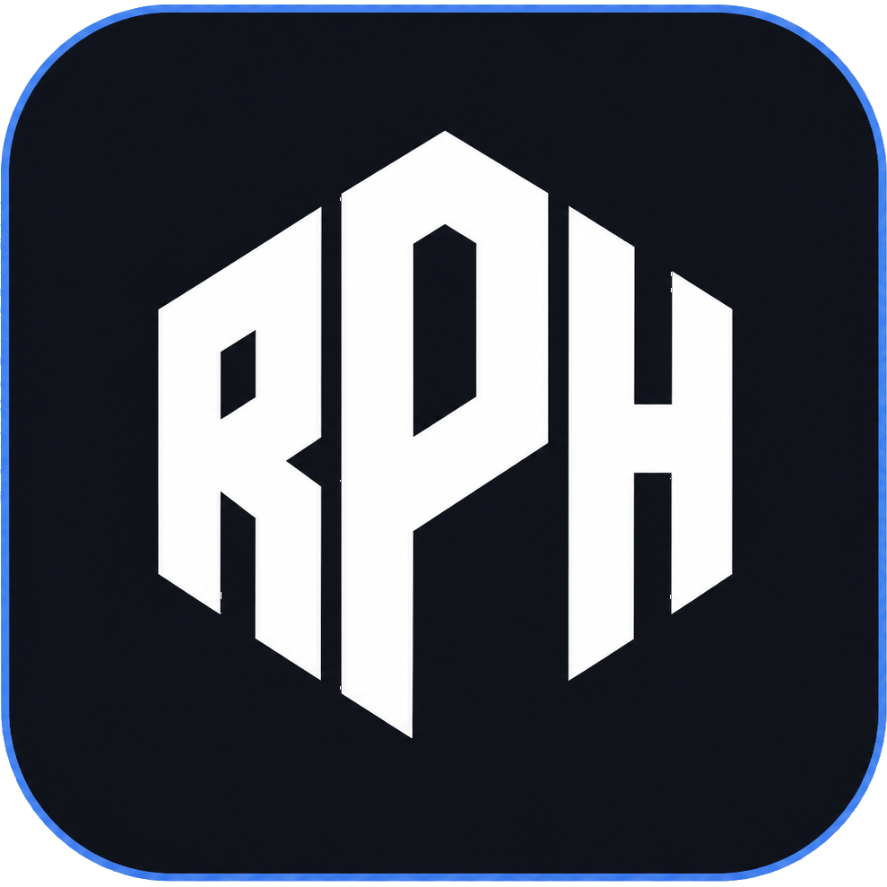
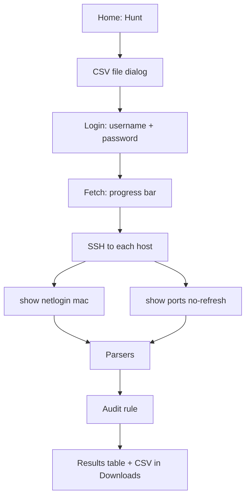

# Rogue Ports Hunter (RPH)

<p align="center">
  
</p>

Audit tool for access ports on **Extreme EXOS** switches. It compares `show ports no-refresh` with `show netlogin mac` and reports ports that appear in the port table but are **not** listed in netlogin MAC output, subject to configured exclusions (e.g. uplink, stack).

The tool runs as a **desktop application** (PySide6): pick an inventory file, enter SSH credentials **once** for the whole run, and view results in the GUI — no per-row credentials in CSV.

| | |
|---|---|
| **Name** | Rogue Ports Hunter |
| **Short name** | RPH |
| **Platform** | EXOS 37.x · Netmiko (`device_type=extreme`) |
| **UI** | PySide6 (Qt) — desktop app |

---

## How it works



| Step | Description |
|------|-------------|
| 1 | Start the app, on the home screen choose **Hunt** |
| 2 | Select inventory CSV — one IPv4 address per row |
| 3 | Enter **one** SSH username and password pair — used for **all** hosts in the list |
| 4 | The app connects to each host in sequence (progress bar, background thread) |
| 5 | A port in `show ports` with no entry in `show netlogin mac` is reported (excluding the skip list) |
| 6 | Results in the table; CSV report saved to **Downloads** as `RPH_results_<timestamp>.csv` |

Operational messages (skipped rows, SSH errors) are printed to the **console** (terminal where you started the app).

---

## User interface (GUI)

The app uses several screens in a `QStackedWidget`:

| Screen (`QStackedWidget`) | Purpose |
|---------------------------|---------|
| **Home** (`homePage`) | *Hunt* button — start an audit |
| **Waiting for file** (`waitingForFilePage`) | Brief transitional screen while the CSV file dialog opens |
| **Login** (`loginPage`) | *username* (required) and *password* — **one pair** for every host in inventory |
| **Fetching** (`fetchingPage`) | Progress bar (real %), “Fetching…” animation during background SSH |
| **Results** (`resultsPage`) | Host / Port table; message with path to the exported CSV |

Layout: `Ui_Files/main_window.ui` (Qt Designer). Theme: `Ui_Files/app_theme.qss`, loaded in `main_window.py`.

**Shortcuts and behavior**

- **Escape** — return to the home screen (disabled while a fetch is running).
- Data collection runs in a **background thread** (`QThread`) so the UI stays responsive.
- On success, the progress bar animates to 100%, then the app navigates to the results screen.

---

## Global SSH credentials

| Aspect | Current behavior | Legacy (no longer supported) |
|--------|------------------|------------------------------|
| CSV file | `host` column only (IPv4) | `host,username,password` header — **not read** |
| Login / password | Once on the login screen | Per CSV row (removed) |
| Session storage | `Globals.global_username`, `Globals.global_password` | — |
| SSH usage | `SSHDataRetriever` for each host in `Globals.devices` | — |

Details:

- **Username** is required — an empty field blocks fetch start (`signals.loginClicked`).
- **Password** may be empty where environment policy allows (e.g. lab).
- Credentials are not written to disk — they live in process memory for the audit run only.

Do not commit inventory files or passwords to the repository.

---

## Requirements

| Component | Version / notes |
|-----------|-----------------|
| Python | 3.11 or newer |
| Dependencies | `pip install -r requirements.txt` (Netmiko, PySide6) |
| Network | SSH access to hosts listed in inventory |

---

## Installation and run

### First-time setup

From the repository root (after clone or extract):

```bash
git clone https://github.com/Verter18328/RPH-RougePortsHunter
cd [project-directory]

python -m venv .venv
```

Activate the virtual environment:

| OS | Command |
|----|---------|
| Windows | `.venv\Scripts\activate` |
| Linux / macOS | `source .venv/bin/activate` |

```bash
pip install -r requirements.txt
python main_window.py
```

### Subsequent runs

```bash
cd [project-directory]
# activate .venv — see table above
python main_window.py
```

> If the repository is already on disk, skip `git clone` and use **Subsequent runs** only.

---

## Inventory file (CSV)

One column per row: IPv4 address. Optional header `host` (legacy `host,username,password` header is accepted but **credentials are not read from CSV**).

```csv
host
192.168.1.10
192.168.1.11
```

| Column | Requirements |
|--------|----------------|
| `host` | IPv4 address (validated on import) |

Invalid rows are skipped; details are printed to the console.

**Do not commit inventory files** — patterns in `.gitignore` (`inventory.csv`, `inventory*.csv`).

---

## Output report (CSV)

Filename: `RPH_results_<YYYY-MM-DD>_<HH-MM-SS>.csv`  
Location: user **Downloads** folder.

Format:

```csv
Host,Port
192.168.1.10,1:5
```

One row per reported port on a given host.

---

## Repository layout

```
.
├── main_window.py          # Entry point — loads UI and Qt event loop
├── signals.py              # Signals, fetch worker thread, screen navigation
├── ui_fetch_feedback.py    # Progress bar and label animation during fetch
├── business_logic.py       # Audit: inventory → SSH → compare → export
├── globals.py              # Shared state (credentials, host list, UI paths)
├── input_data_reciever.py  # CSV inventory read
├── data_validation.py      # IPv4 validation
├── ssh_data_retriever.py   # SSH session, OutputData
├── netlogin_mac_parser.py
├── ports_parser.py
├── export_results.py
├── Ui_Files/
│   ├── main_window.ui      # Window layout (Qt Designer)
│   └── app_theme.qss       # Application stylesheet
│   └── rph_logo.png        # RPH logo used in app icon and screens
├── requirements.txt
├── LICENSE
└── .gitignore
```

| Module | Responsibility |
|--------|----------------|
| `main_window.py` | Loads `.ui` and QSS theme, starts the app |
| `signals.py` | Buttons, progress, results table, background fetch |
| `ui_fetch_feedback.py` | Smooth progress bar and “Fetching…” animation |
| `globals.py` | `global_username` / `global_password`, device list, UI paths |
| `business_logic.py` | Core audit: `RoguePortsHunter` |
| `input_data_reciever.py` | Inventory CSV selection and parsing (`InputDataReceiver`) |
| `ssh_data_retriever.py` | SSH commands and `OutputData` |
| `export_results.py` | CSV export to Downloads |

Operational data excluded from the repo (`.gitignore`): inventory, `samples/`, `output/`, `logs/`, `raw/`, `RPH_results_*.csv` under the project tree.

---

## Port exclusions

`LAB_SAMPLE_SKIP_PORTS` in `business_logic.py` skips laboratory uplink ports (10G stack). In production, exclusions should be **per host** (configure in code or future config).

---

## Development status

| Implemented | Planned |
|-------------|---------|
| CLI parsers, audit rule, lab skip list | Concurrent SSH for large inventories |
| PySide6 GUI (inventory, login, progress, results) | Bastion, secrets management (e.g. `.env`) |
| Inventory import and IPv4 validation | Configurable per-host exclusions |
| Single SSH username/password for the whole host list | — |
| SSH and CSV export | — |

---

## Security and sensitive data

- Do not commit inventory files, passwords, or reports containing network data.
- Reports may contain IP addresses and port identifiers — follow your organization’s network data handling policy.
- Empty passwords are acceptable only where environment policy allows (e.g. isolated lab).

---

## Project information

| Field | Value |
|-------|--------|
| Repository | https://github.com/Verter18328/RPH-RougePortsHunter |
| Author | [Verter18328](https://github.com/Verter18328) |
| License | [MIT](LICENSE) |
