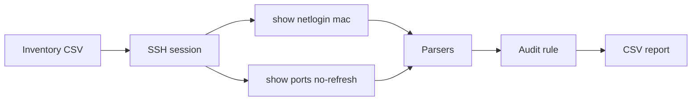

# Rouge Ports Hunter (RPH)

Audit tool for access ports on **Extreme EXOS** switches. It compares `show ports no-refresh` with `show netlogin mac` and reports ports that appear in the port table but are **not** listed in netlogin MAC output, subject to configured exclusions (e.g. uplink, stack).

| | |
|---|---|
| **Name** | Rouge Ports Hunter |
| **Short name** | RPH |
| **Platform** | EXOS 37.x · Netmiko (`device_type=extreme`) |

---

## How it works



| Step | Description |
|------|-------------|
| 1 | Select inventory file (file dialog) |
| 2 | Per host: SSH and run both commands |
| 3 | Parse CLI output into port lists |
| 4 | Compare: port in `show ports` with no entry in `show netlogin mac` → report row (excluding skip list) |
| 5 | Write `RPH_results_<timestamp>.csv` to the user’s default Downloads folder |

---

## Requirements

| Component | Version / notes |
|-----------|-----------------|
| Python | 3.11 or newer |
| Netmiko | `pip install -r requirements.txt` |
| tkinter | Standard library (CSV file picker). Linux: system package `python3-tk` |
| Network | SSH access to hosts defined in inventory |

---

## Installation and run

### First-time setup

From the repository root (after clone or extract):

```bash
git clone https://github.com/Verter18328/RPH-RougePortsHunter
cd [project-directory]

python -m venv .venv
```

Activate the virtual environment:

| OS | Command |
|----|---------|
| Windows | `.venv\Scripts\activate` |
| Linux / macOS | `source .venv/bin/activate` |

```bash
pip install -r requirements.txt
python main.py
```

### Subsequent runs

```bash
cd [project-directory]
# activate .venv — see table above
python main.py
```

> If the repository is already on disk, skip `git clone` and use **Subsequent runs** only.

On startup, select the inventory file. Operational messages appear in the console; the report is written to **Downloads**.

---

## Inventory file (CSV)

Optional header row, then data rows.

```csv
host,username,password
[IPv4 address],[username],[password]
```

| Column | Requirements |
|--------|----------------|
| `host` | IPv4 address (validated on import) |
| `username` | SSH login (required, non-empty) |
| `password` | SSH password — **may be empty** |

Invalid rows are skipped; details are printed to the console.

**Do not commit inventory files** — patterns in `.gitignore` (`inventory.csv`, `inventory*.csv`).

---

## Output report (CSV)

Filename: `RPH_results_<YYYY-MM-DD>_<HH-MM-SS>.csv`

Format:

```csv
Host,Ports
[IPv4 address],[slot:port]
```

One row per reported port on a given host.

---

## Repository layout

```
.
├── main.py
├── input_data_reciever.py
├── data_validation.py
├── ssh_data_retriever.py
├── netlogin_mac_parser.py
├── ports_parser.py
├── export_results.py
├── requirements.txt
├── LICENSE
└── .gitignore
```

| Module | Responsibility |
|--------|----------------|
| `main.py` | Flow: inventory → SSH → audit → export |
| `input_data_reciever.py` | CSV file selection and read |
| `data_validation.py` | Host and username validation |
| `ssh_data_retriever.py` | SSH, `Device` / `OutputData` models |
| `netlogin_mac_parser.py` | Parser for `show netlogin mac` |
| `ports_parser.py` | Parser for `show ports no-refresh` |
| `export_results.py` | CSV report export |

Operational data excluded from the repo (`.gitignore`): inventory, `samples/`, `output/`, `logs/`, `raw/`, `RPH_results_*.csv` under the project tree.

---

## Port exclusions

`LAB_SAMPLE_SKIP_PORTS` in `main.py` skips laboratory uplink ports (10G stack). In production, exclusions should be **per host** (configure in code or future config).

---

## Development status

| Implemented | Planned |
|-------------|---------|
| CLI parsers | Concurrent SSH, large host counts |
| Audit rule and lab skip list | Bastion, secrets management (e.g. `.env`) |
| Inventory import and validation | Configurable per-host exclusions |
| SSH and CSV export | — |

---

## Security and sensitive data

- Do not commit inventory files or credentials.
- Reports may contain IP addresses and port identifiers — follow your organization’s network data handling policy.
- Empty passwords are acceptable only where environment policy allows (e.g. isolated lab).

---

## Project information

| Field | Value |
|-------|--------|
| Repository | https://github.com/Verter18328/RPH-RougePortsHunter |
| Author | [Verter18328](https://github.com/Verter18328) |
| License | [MIT](LICENSE) |
